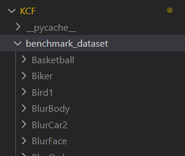
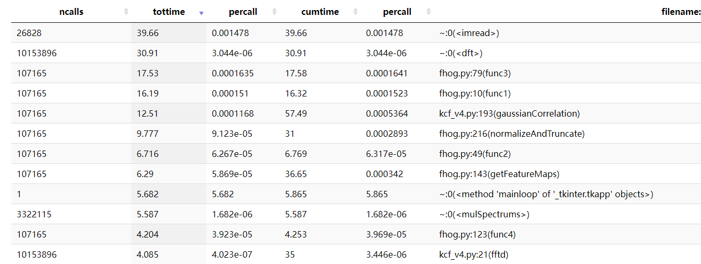

# 目标跟踪系统

*小组成员仅按姓氏首字母进行排序：*

+ 董亚竺 2021213628
+ 黄敬元 2021213640
+ 周睿杰 2021213611


# Introduction

**目标跟踪系统**是一个基于Kernelized Correlation Filters以及相关衍生算法的、实时跟踪目标的综合推理系统。我们将这一份课题解读为涵盖：

+ 提供追踪制定目标的功能
+ 提供推理系统UI界面
+ 内部的推理优化（Inference Speed optimizing, http requests processing）


# Roadmap

+ [x] 初步实现MKCFup算法 

+ [x] 了解推理原理，做优化：
  + [x] 重构代码，这个代码根本无法应用在工业上，必须重构为一份可移植的code
  + [x] 可能的算法优化 - 能否使用CUDA、SIMD指令集
  + [ ] 推理方面优化
+ [x] 重构一版Python版本的算法
+ [x] 前后端的软件工程问题：有一个图像标注的过程转化


# Quick Start

> 强烈建议使用linux环境，如果使用windows环境，遇到CMake编译问题请自行调整^ ^


__1. 安装Python相关依赖库__

首先是安装CMake与Libtorch(有可能会用到)

```bash
sudo apt install cmake
```

至于libtorch的下载方法，您可以查阅：[PyTorch官方文档](https://pytorch.org/get-started/locally/)

完成了相关库的下载之后，您可以使用如下指令来安装代码依赖：

```bash
pip install numba	# 主要使用numba来进行加速
pip install fastapi[all]	# 推理部署
```


__2. (可选)编译运行我们制作的CUDA推理__

```bash
git clone https://github.com/SamuraiBUPT/KCF-tracking-sys.git
cd KCF-tracking-sys
pip install -e .
```

这会自动开始编译C++文件。


__3. 启动推理__

然后您可以直接使用我们提供的基于`fastapi`的server进行测试：

```bash
cd server
python3 server.py
```

在`localhost:8000`您可以进行交互与查看部署结果。


__4. 检查我们的实验结果__

您需要先下载数据集，我们已经上传至[百度云](https://pan.baidu.com/s/1uOhKJgo-B3ZiKuc2RJi2TQ?pwd=5rj6)

然后解压到`KCF/benchmark_dataset`路径下。您的项目结构应该看起来像这样：



可以开始运行实验代码：

```bash
cd KCF
python3 eval_inference.py
```


# Optimize

## 1. Analysis

要使用cuda优化，不能盲目着手，要找出来到底什么地方是整个算法的bottleneck，并且使用cuda计算还要考虑memcpy的时间，如果时间瓶颈都比较小的话，那就没必要进行cuda计算。（因为无法trade off）


+ 先找是否是精度问题
+ 再考虑profile bottleneck
+ 再考虑cuda优化


__1.1 精度问题__

我认为计算精确度的问题，应该是精度的问题，不是其他的。

如果尝试使用更高的精度，也许效果会更好。

**结论**：并没有更好


__1.2 bottleneck分析__




__初步profile结果：__

+ [x] NormalizeAndTruncate里面调用了**func3.**  - rank No.3
+ [x] getFeatureMaps调用了：**func1, func2**  - rank No.4, No.7
+ [x] PCAFeatureMaps调用了：**func4**  - rank No.10
+ 还有一个就是**gaussianCorrelation**  - rank No.5
  + 包括mulSpectrums
+ FFTD和dft其实是一伙的。（fftd函数内部调用的就是cv2.dft） - rank No.2


# Reference

## Papers

With respect, we have read multiple awesome papers related to KCF algorithm, listed as follows:

+ KCF算法：[High-Speed Tracking with Kernelized Correlation Filters](https://arxiv.org/pdf/1404.7584) **2014**
+ 进阶：[High Speed Tracking With A Fourier Domain Kernelized Correlation Filter](https://arxiv.org/pdf/1811.03236v1) **2018**
+ 进阶：[High-speed Tracking with Multi-kernel Correlation Filters](https://openaccess.thecvf.com/content_cvpr_2018/papers/Tang_High-Speed_Tracking_With_CVPR_2018_paper.pdf) **2018**


## Github Code

+ [KCF C++ Implementation](https://github.com/foolwood/KCF)
+ [MKCFup C++  Implementation](https://github.com/tominute/MKCFup) **Core**
+ [KCF using GPU](https://github.com/denismerigoux/GPU-tracking)


## Blogs

+ [KCF CSDN Blog](https://blog.csdn.net/EasonCcc/article/details/79658928)
+ [KCF Zhihu Notebook](https://zhuanlan.zhihu.com/p/33543297)
+ 有关图像的梯度直方图讲解：https://zhuanlan.zhihu.com/p/85829145